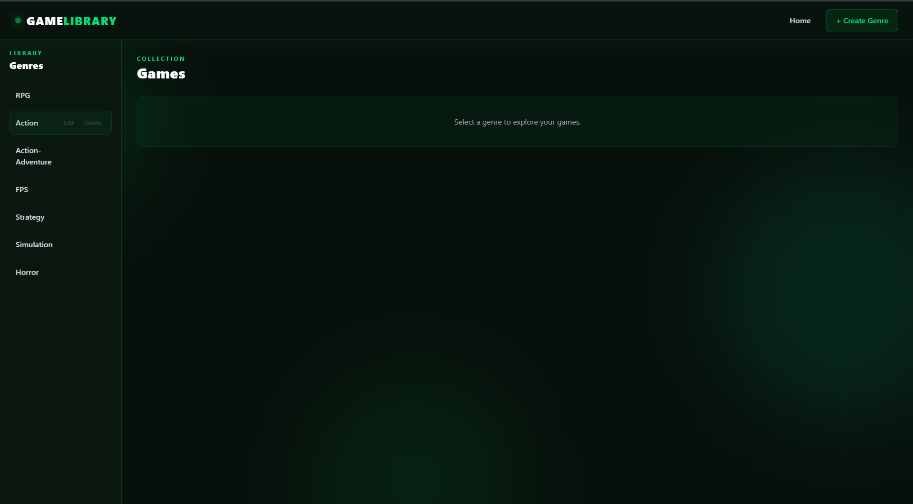

# 🎮 Game Library

A full-stack game library application built with React, Express, PostgreSQL, and Tailwind CSS.

## 🚀 Live Demo

https://game-library-black.vercel.app

## ✨ Features

- Browse games by genre
- Create, update, and delete games
- Create, update, and delete genres
- PostgreSQL database with relational data
- REST API built with Express
- Responsive gaming-themed UI
- Deployed full-stack application

## 🛠️ Tech Stack

- **Frontend:** React, Vite, Tailwind CSS
- **Backend:** Node.js, Express.js
- **Database:** PostgreSQL, Neon
- **Deployment:** Vercel, Render

## 🏗️ Architecture

React (Vercel)
      ↓
Express REST API (Render)
      ↓
PostgreSQL (Neon)

📂 Project Structure
game-library/
├── controllers/
├── db/
├── frontend/
├── routes/
├── seed/
├── views/
├── app.js
└── package.json

🔌 API
Games
GET /api/games — Get all games
POST /api/games — Create a game
PUT /api/games/:id — Update a game
DELETE /api/games/:id — Delete a game
Genres
GET /api/genres — Get all genres
POST /api/genres — Create a genre
PUT /api/genre/:id — Update a genre
DELETE /api/genres/:id — Delete a genre
🗄️ Database

The application uses two related PostgreSQL tables:

Genres — stores game genres
Games — stores games and references their genre through a foreign key
💻 Running Locally
git clone https://github.com/SparshMhjn25/game-library.git
cd game-library
npm install
npm start

For the frontend:

cd frontend
npm install
npm run dev

Create a .env file with your PostgreSQL connection details before running the backend.

📚 What I Learned
Building REST APIs with Express
PostgreSQL and relational database design
CRUD operations
Connecting React to a backend API
MVC-style project organization
Environment variables and CORS
Deploying a full-stack application

## 📸 Screenshots

### Game Library

### Game Management

### Genre Management
